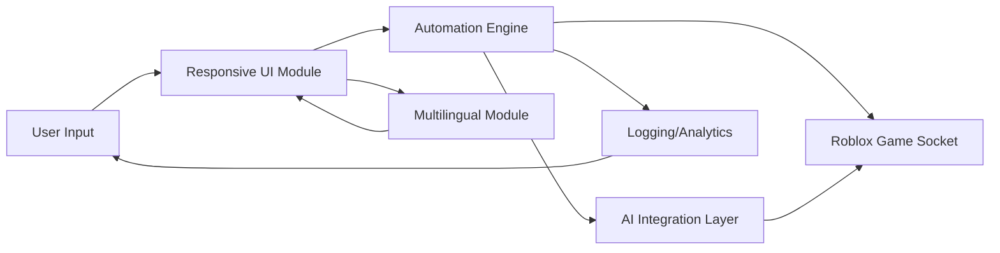

# Roblox-Fisch-Assistant 🎮🐠

Optimize your Roblox aquatic adventures with advanced automations, immersive intelligence, and real-time interactions!  
Unlock effortless gameplay, seamless automation, and character personalization with this next-level script suite.

---

**Download the latest version above to get started!**

---

## 🌊 Overview

Welcome to **Roblox-Fisch-Assistant**, the innovative companion to your Roblox aquarium simulation experience. Drawing inspiration from automated fishing gameplay, this repository transcends the realm of simple scripts by offering:

- 🎣 Adaptive Fish Detection
- 🤖 Automated MiniGame Solvers  
- 🗣️ Multilingual Responses (UI + Console)
- 🔮 AI-Driven Profile Recommendations (OpenAI & Claude integration)
- 🧑‍💻 Personalized Game Profiles
- ⚡ Real-Time Stats & Responsive Dashboards

Whether you’re an aspiring digital angler or an aquatic tycoon, this script suite tailors every detail to streamline your journey on Roblox waters.

---

## 🎯 Key Features

- **Intelligent Auto Fish:** Detects optimal strategies using OpenAI & Claude AI for each fishing site.
- **Dynamic MiniGame Automation:** Completes mini-challenges with calculated responses and customizable parameters.
- **Responsive UI:** Context-aware, overlays user stats with instant feedback and adaptable layouts for desktop/mobile.
- **Multilingual Support:** Supports English, Spanish, German, French, and Japanese (auto-detect at launch).
- **24/7 Customer Support:** A responsive team ready to help you resolve every technical and gameplay question—any time.
- **Easy Profile Switching:** Change between custom play styles and preferences in seconds.
- **Rich Logging & Analytics:** Tracks session performance, achievements, and newly found aquatic species.
- **Seamless Platform Integration:** Compatible with a wide range of Windows, MacOS, and Linux distributions.
- **Configurable Profiles:** All behaviors and preferences stored in simple yet extensible configuration files.

---

## 🚀 Next-Gen Automation with AI

**The power of conversation. The insight of prediction.**  
Both OpenAI’s GPT API and Claude API are natively supported. Personalize your strategy: These APIs optimize actions dynamically, unlock secret challenges, and offer life-like chat with NPCs.

- Customize AI prompts in your configuration.
- Responsive advice for in-game decisions.
- Future-proof—updates with new AI models!

---

## 🕹️ Example Console Invocation

To launch with your custom configuration and multilingual support enabled, use:
  
    ./fisch-assistant --config=profile_jordan.yaml --lang=de

The assistant runs in the background, monitoring in-game events and auto-responding with AI-generated optimal actions.

---

## 🗂️ Example Profile Configuration

Here’s a sample of a robust, multilingual player profile configuration (profile_jordan.yaml):

    player:
      name: "JordanFisch"
      preferred_fish:
        - Salmon
        - Tuna
      minigame_difficulty: "adaptive"
      ui_language: "de"
      responsive_ui: true
      ai_integrations:
        openai_enabled: true
        claude_enabled: false
      auto_save: true
      achievement_goals:
        - "Legendary Fisher"
        - "Aquatic Curator"
      analytics_opt_in: true

Fully adjust every element; the AI tailors strategy to your goals and play style.

---

## 🖥️ 💻 📱 OS Compatibility Table

| OS        | CLI Support | UI Dashboard | Real-Time AI | Localization |
|:---------:|:-----------:|:------------:|:-------------:|
| Windows   | ✅          | ✅           | ✅            | ✅            |
| MacOS     | ✅          | ✅           | ✅            | ✅            |
| Linux     | ✅          | ✅           | ✅            | ✅            |
| Roblox Mobile* | ⚡ Planned | ❌           | ⚡ Planned     | ⚡ Planned     |

> _Mobile support coming soon! Connect your desktop and unlock progress on all devices._

---

## 🧠 Mermaid Diagram: System Overview

The diagram outlines how every layer communicates, ensuring consistent, real-time, and personalized automation.

---

## 🏆 Feature List

- OpenAI & Claude API for tailored, intelligent decision making.
- Auto detection of events — from rare fish appearances to mini-games.
- Human-like responses for unbeatable in-game presence.
- Multilanguage UI—seamlessly switches based on player profile.
- Extensively customizable configuration for in-depth personalization.
- Elegant, minimal, and delay-free status overlay.
- Discord and webhook alert integration (optional).
- Regular updates using 2026’s emerging automation technologies.
- 24/7 support, fair-play focused, and robust security monitoring.
- Comprehensive documentation for advanced users and beginners.

---

## 🔑 Keywords & Discoverability

Elevate your search with these search-centric keywords:

- Roblox assistant automation
- AI-enhanced Roblox scripts
- Auto-minigame for Roblox
- OpenAI Claude Roblox integration
- Multilingual Roblox automation
- Responsive UI game script
- Automated fish detection Roblox
- 2026-ready Roblox script tools  
- In-game analytics & monitoring
- Real-time Roblox support

---

## ⚖️ License

Distributed under the MIT License. See [LICENSE](LICENSE) for details.

---

## ⚠️ Disclaimer (2026 Edition)

This project is an independent Roblox supplement. It prioritizes user safety and platform compliance. All users must adhere to Roblox’s Terms of Service and respect community standards. AI accuracy and game behavior may evolve as APIs and platforms update; always use responsibly!

---

## 📫 Need Help? 24/7 Support

Connect via:
- Dashboard Help section
- Provided in-script feedback
- Official Discord support channel (details in doc)
  
We are always available to ensure your adventure remains smooth and enjoyable!

---

Start your intelligent Roblox journey today!

---